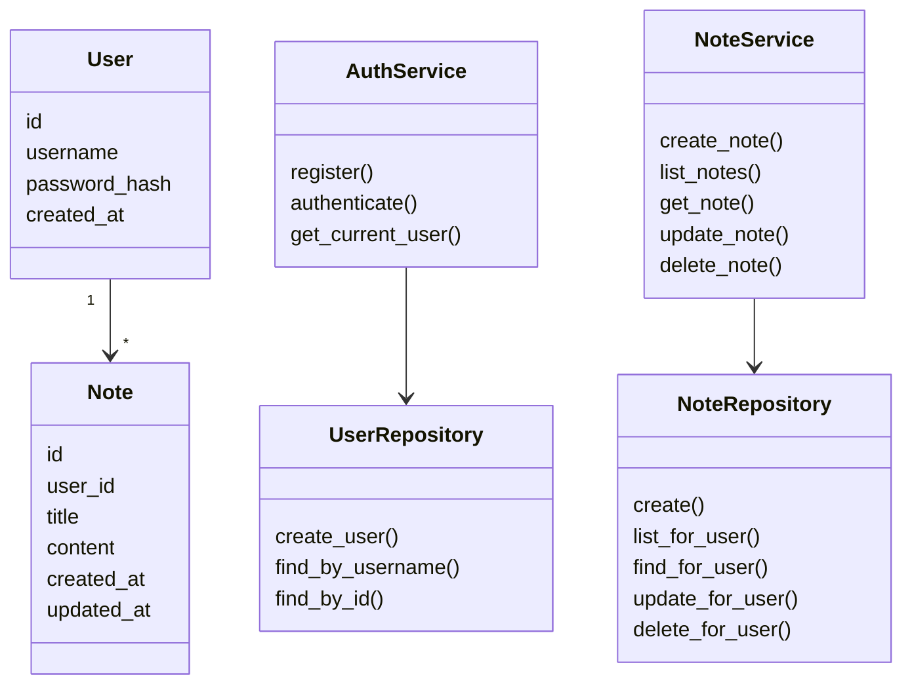
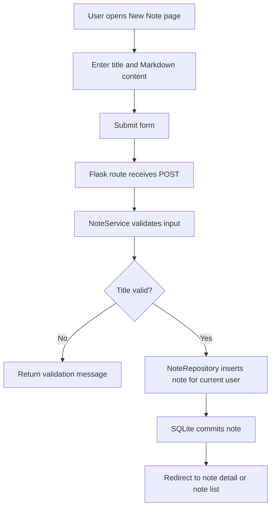
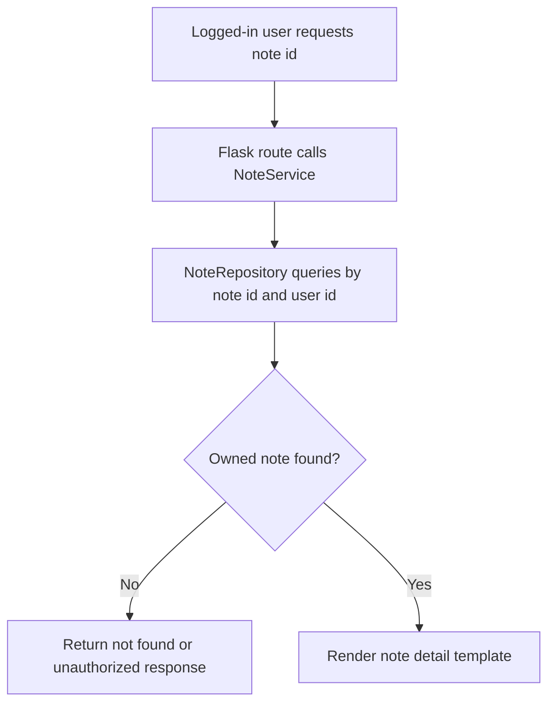

# 04 UML And Design

## Purpose

This document adapts the Week 4.2 UML design package to the final Flask web architecture. It preserves the design intent without requiring the original C++ class structure.

## Source Artifacts Used

- Week 4.2 Complete UML Design Package
- Week 5.2 Requirements-to-UML Traceability Matrix
- Week 6 Development Environment and First Realization Slices

## Design Scope

The final MVP design supports:

- Local user registration and login
- User-owned text notes
- Create, list, open, edit, and delete workflows
- Markdown text preservation
- SQLite persistence
- MVC-style separation
- pytest validation

## Updated Conceptual Class Model

## Updated Web Workflow: Create And Save Note

## Updated Web Workflow: Open Existing Note

## MVC Mapping

| Original UML Concept | Flask MVP Equivalent |
| --- | --- |
| MainView / NotesWorkspace | Jinja templates and CSS |
| NoteController | Flask routes/controllers |
| NoteManager | NoteService |
| NoteRepository | NoteRepository using SQLite |
| LocalStorage | SQLite connection and schema |
| UserSession | Flask session |
| TextNote | Note row with Markdown-compatible content |

## Removed Or Deferred UML Elements

- SecureNote is deferred.
- EncryptionService is deferred.
- VersionHistory is deferred.
- A dedicated SearchIndex is deferred. FR-6 will be implemented later as a simple SQLite title/content search scoped by user.
- VoiceNote is deferred.
- Plugin-style extensibility is deferred.

## Migration From Old C++ Path

Migrated:

- Note, TextNote, NoteManager, NoteRepository, LocalStorage, NoteController, and UserSession responsibilities
- Create/save/open workflow logic
- MVC separation and thin-view principle
- Failure handling for validation and unauthorized access

Updated:

- C++ classes become Python service/repository/data responsibilities
- Desktop use case flows become Flask request/response workflows
- MainView and NotesWorkspace become Jinja templates
- LocalStorage becomes SQLite database access
- UserSession becomes Flask session plus user ownership checks

## Design Quality Notes

- Views should not own validation or persistence.
- Routes should stay thin and delegate business rules to services.
- Repositories should hide SQL details from services and templates.
- Every note operation must include `user_id` to preserve basic multi-user boundaries.
- Error messages should be clear and controlled.
